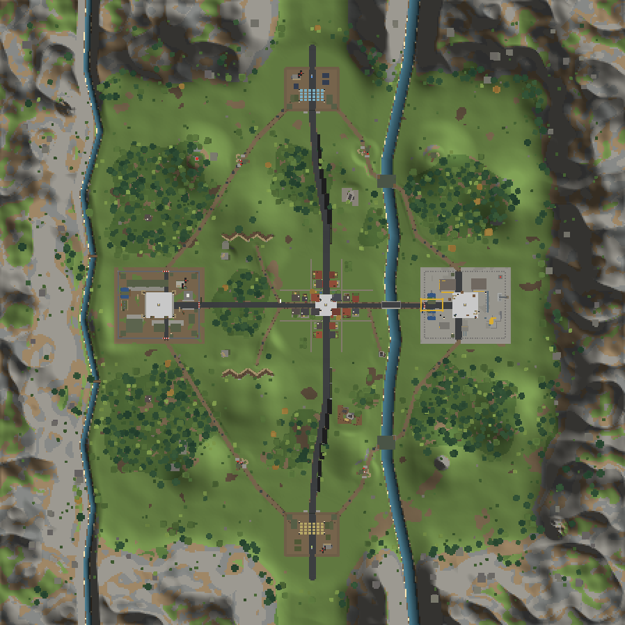
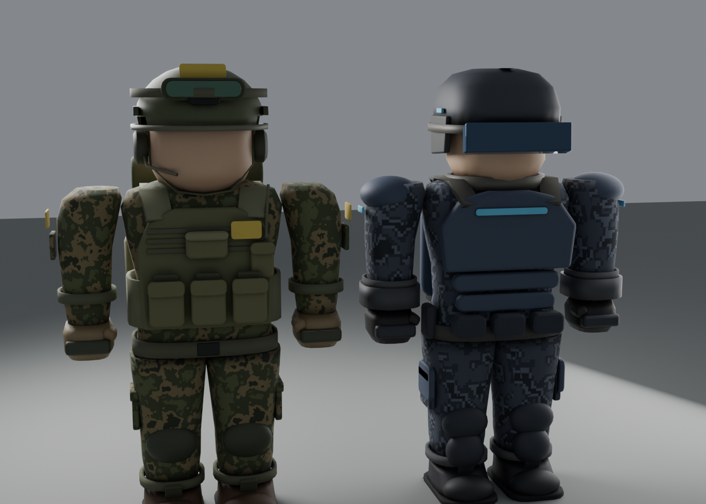
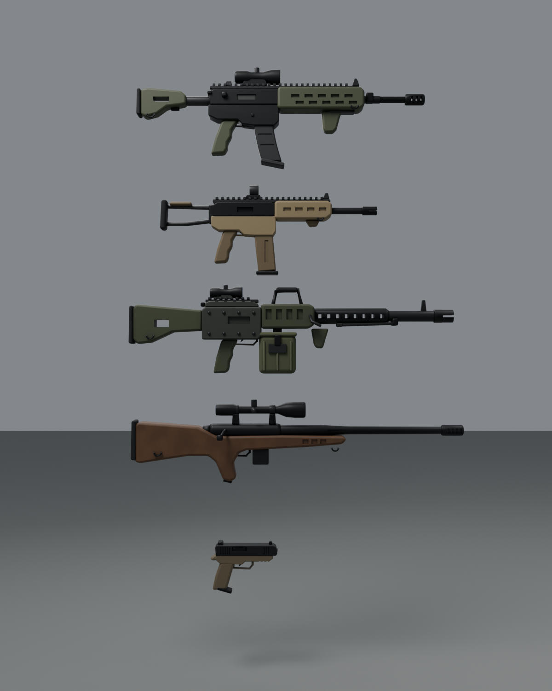
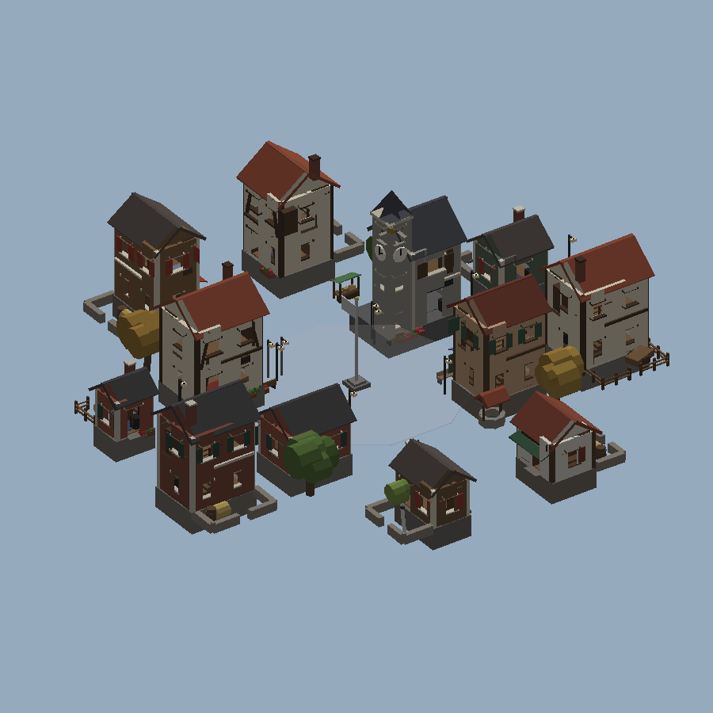
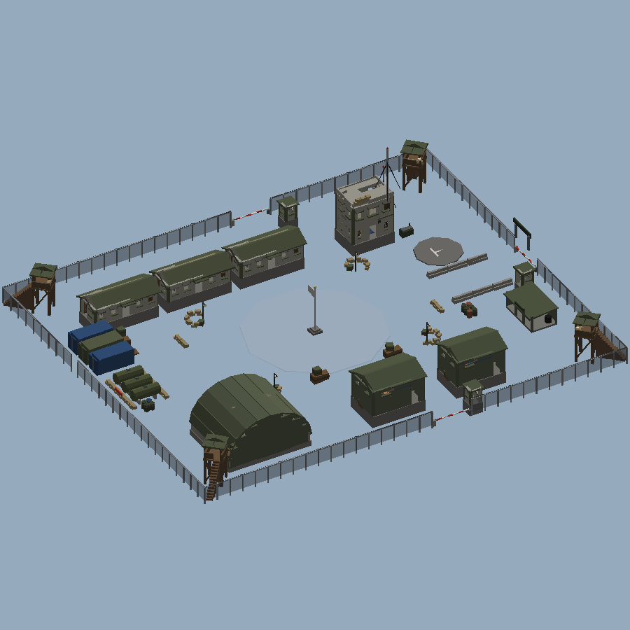
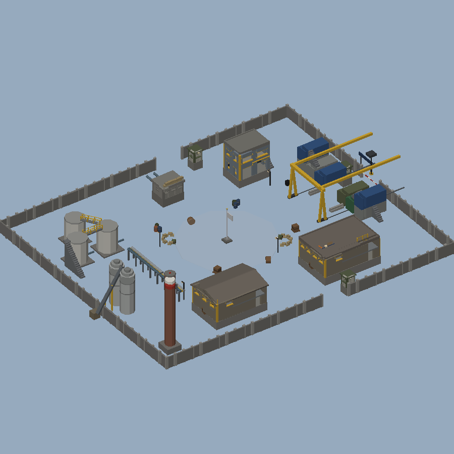

# OPERATION IRONFRONT

An original large-scale multiplayer military team shooter for Roblox (R6), built with Luau and Rojo.
Two fictional factions fight over three objectives in **Kestrel Valley**:

* the **Ashford Coalition** (olive, south)
* the **Varn Directorate** (steel blue, north)

Kestrel Valley is a mountain-ringed valley with a river, forests, trenches, a military base, a
village and an industrial works. No third-party or unlicensed assets are used. Geometry is Roblox
primitives with built-in materials, and audio IDs are empty placeholders
(see [docs/ASSETS.md](docs/ASSETS.md)).


*Offline top-down render of the generated heightfield and structures (not a Roblox screenshot).*

## Status

| Area | State |
|---|---|
| **Milestone 1 — visual foundation** | ✅ Implemented and verified offline. Needs a Studio pass: [docs/STUDIO_VALIDATION.md](docs/STUDIO_VALIDATION.md) |
| Terrain: mountains, river and brook, trenches, spires, painted roads, slope-aware materials | ✅ |
| Fort Harlow (A), Millbrook village with ~20 buildings (B), Kessler Works (C), 2 HQs, 15 outposts, bridges | ✅ |
| Buildings with interiors, stairs, roof access, framed windows, pitched and vaulted roofs | ✅ |
| 5 tree species, bushes, rocks, logs, puddles | ✅ |
| Cinematic lighting persisted in Rojo; Studio bake plugin; runtime fallback | ✅ |
| **Milestone 2 — soldiers, weapons, animation** | ✅ Implemented and verified offline. Needs a Studio pass (see the checklist) |
| Faction kits, 5 weapons (Blender FBX/GLB + in-game fallback), procedural R6 animation, first-person viewmodel with aim-down-sights | ✅, see [docs/ASSET_PIPELINE.md](docs/ASSET_PIPELINE.md) |
| Phase 1 gameplay: teams, spawning, capture points, tickets, HUD | ✅ |
| SFX/VFX, full UI and classes, vehicles and destruction | ⏳ Milestones 3–5, see [docs/ROADMAP.md](docs/ROADMAP.md) |

> **Honesty note:** the code is syntax-checked and unit-tested, the whole map generator is executed
> offline under Lune with real Roblox datatypes, and the place and plugin build with Rojo. None of it
> has been run inside Roblox Studio by the author yet. Please work through
> [docs/STUDIO_VALIDATION.md](docs/STUDIO_VALIDATION.md).

| Soldiers (Blender render) | Weapons (Blender render) |
|---|---|
|  |  |

| Millbrook | Fort Harlow | Kessler Works |
|---|---|---|
|  |  |  |

*Offline software renders of generated parts, without terrain.*

## Layout

```
default.project.json         Rojo tree (streaming, lighting + effects, Teams, Players)
plugin.project.json          Studio plugin "Ironfront Tools" (Bake / Clear map)
src/shared  -> ReplicatedStorage.Shared
  Config/   GameConfig, WeaponConfig, MapLayout, SoundConfig      (pure data)
  Logic/    CaptureLogic, TicketLogic, WeaponLogic, TeamLogic     (pure, unit-tested)
  Util/     Rng, RateLimiter, Signal, Validate, Color
  Net/      Remotes (single definition of every network endpoint)
src/server  -> ServerScriptService.Server (init.server.lua bootstrap)
  Net.lua, GameState.lua
  Services/        TeamService, SpawnService, UniformService, WeaponFactory,
                   CombatService, ObjectiveService, MatchService
  World/           Map generator: Plans, Heightfield, TerrainGenerator, Kit, Props,
                   Buildings, Structures, Foliage, Sites/*, MapBuilder, Env
src/client  -> StarterPlayerScripts.Client
  Controllers/     WeaponController, EffectsController, HudController,
                   TeamSelectController, ObjectiveMarkers, SoundPlayer
  UI/              Ui helper, Theme
tests/             luau unit tests + Lune generation harness
scripts/           check.sh, preview renderers, blender/ (asset modelling library + build)
docs/              MAP_PIPELINE, STUDIO_VALIDATION, ASSETS, ROADMAP, previews/
```

The map pipeline (generator, baking and previews) is documented in
[docs/MAP_PIPELINE.md](docs/MAP_PIPELINE.md).

### Authority & networking model
* The client only sends **intent**: `RequestTeam(teamId)`, `Fire({o=origin, d=direction})`, `Reload()`.
* Every remote passes through `Net.on` (token-bucket rate limit per player + `pcall`).
* `CombatService` re-validates everything: alive, holding the right weapon, cadence
  (≥75% of the fire interval), ammo, not reloading, origin within 10 studs of the server head,
  unit direction, match active. The **server raycasts** and applies damage via `Humanoid:TakeDamage`
  (respects spawn ForceFields). No friendly fire.
* Scoring, tickets, capture state and victory live exclusively on the server; clients read
  `ReplicatedStorage.GameState` attributes (independent of what workspace parts have streamed in).
* Cosmetic shot effects use an `UnreliableRemoteEvent` and are distance-culled on the client.

### Performance & scale
The target is a stable 24-player server; 80 players will only be claimed after load testing.
* Objective checks are O(players × zones) on a 0.25 s tick, and zone attributes replicate only on
  change.
* Tracers use unreliable remotes and are distance-culled.
* The map is anchored, `CanTouch=false` geometry (~21 k parts, 65 lights) under StreamingEnabled with
  `PauseOutsideLoadedArea`.
* Buildings and trees are atomic streaming models; buildings request `StreamingMesh` LOD.
* Foliage canopies don't collide or block raycasts.

## Setup: Rojo → Roblox Studio

> **Day to day (Windows):** clone once, then double-click `Sync-Ironfront.cmd`. It pulls new
> commits safely and starts Rojo. `Watch-Ironfront.cmd` pulls updates automatically. There are no
> more ZIP downloads. Full guide: [docs/WORKFLOW.md](docs/WORKFLOW.md).

1. **Install Rojo 7.7.0**
   * CLI: `aftman install` in this repo (uses `aftman.toml`), or download it from
     <https://github.com/rojo-rbx/rojo/releases>.
   * Studio sync plugin: `rojo plugin install`.
   * Ironfront tools plugin: `rojo build plugin.project.json --plugin IronfrontTools.rbxmx`, then
     restart Studio.
2. **Create a place:** Studio → *New* → *Baseplate*. Delete `Workspace.Baseplate` and
   `Workspace.SpawnLocation`.
3. **Game settings** (the place must be saved to Roblox for some of these):
   * *Avatar* → **Avatar Type: R6**
   * *Places* → **Max Players: 24**
4. **Sync:** run `Sync-Ironfront.cmd` (or `rojo serve`) in the repo, then *Rojo* plugin → **Connect**. Code, lighting effects and
   Workspace streaming settings sync in.
5. **Bake the map** (Edit mode): toolbar **Ironfront → Bake Map**. Wait for
   `[MapBuilder] done: … parts` in Output.
6. **Save** (File → Save to Roblox / Publish). The terrain and `Workspace.Map` are stored in the place.
7. **Play-test:** *Test* → *Clients and Servers* → 2+ players. Pick a side in each window.

Skipping step 5 still works: the server generates the map at startup (see
[docs/MAP_PIPELINE.md](docs/MAP_PIPELINE.md)). To build a place file offline instead, run
`rojo build default.project.json -o OperationIronfront.rbxlx`, open it, then do steps 3, 5 and 6.

## Controls
* **PC:**
  * WASD move, mouse aim (over-the-shoulder), LMB fire, RMB aim down sights, R reload.
  * 1/2 or Q switch weapon, Shift sprint, C or Ctrl crouch.
  * Alt frees the cursor, Tab shows the scoreboard, M changes team while redeploying.
* **Gamepad:** R2 fire, L2 aim, X reload, Y switch, L3 sprint, B crouch.
* **Mobile:** thumbstick move, drag to aim (screen centre), on-screen FIRE, AIM, R, SWAP, RUN and
  CRCH buttons. AIM, RUN and CRCH are toggles.

## Development checks
```
./scripts/check.sh      # luau syntax, unit tests, Lune generation harness, rojo builds
```
Tools: `luau`, `luau-compile`, `rojo`, and optionally `lune` (for the harness), on PATH or via
`TOOLS_DIR=...`. CI (`.github/workflows/check.yml`) runs the same script on every push.
