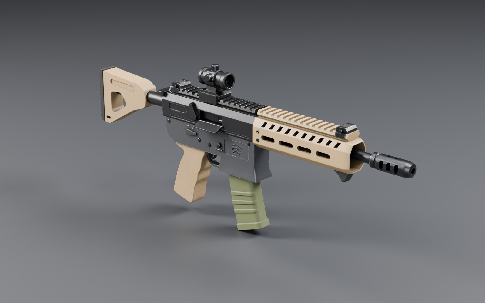
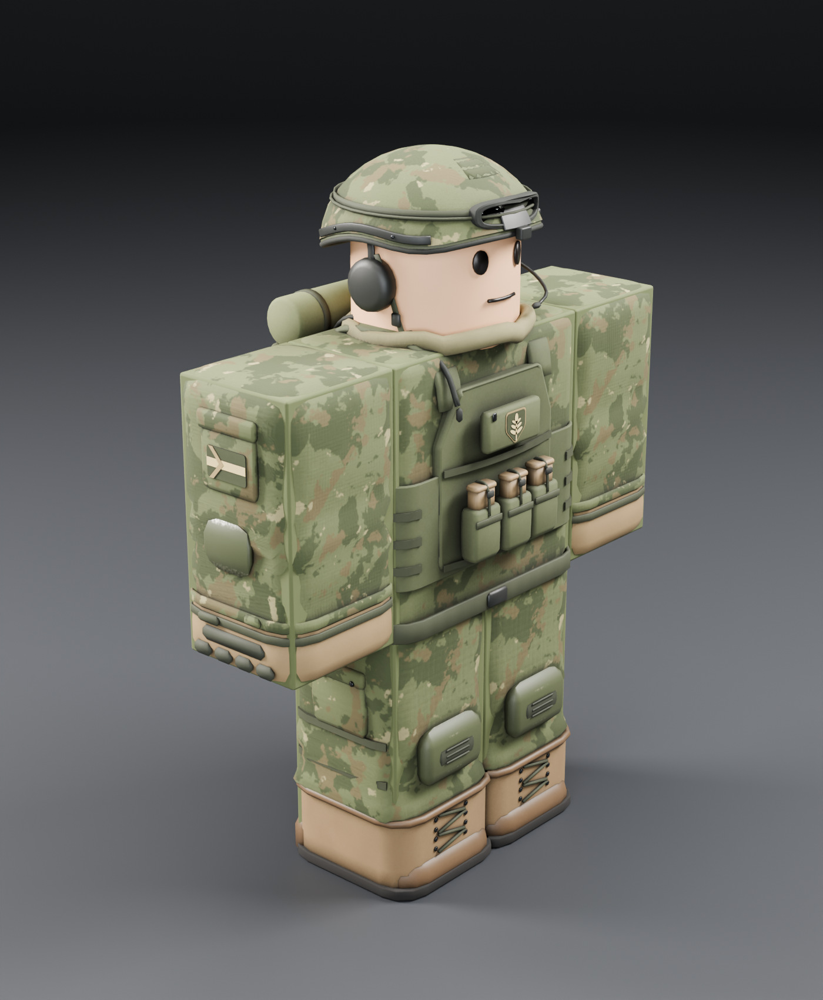

# Premium assets: IR-7 Carbine and Ashford Coalition kit

These are the first two hand-modelled assets of the art pass. Everything is real Blender geometry:
filleted profile extrusions, lofts, lathes, swept sections, EXACT boolean cuts, bevels and weighted
normals. Each asset has a baked PBR texture atlas. Nothing here is built from Roblox parts.

| Asset | Replaces in game | Files | Triangles |
|---|---|---|---|
| **IR-7 Carbine** | carbine slot `CB` (was the primitive "KC-9 Talon") | `assets/premium/weapons/IR7/` | ≈34 k (10 MeshParts) |
| **Ashford Coalition soldier** | team `Alpha` gear (was the primitive kit) | `assets/premium/characters/Ashford/` | ≈24.5 k base, ≈28 k with every variant |

Each folder contains:

* `*.blend`: the source scene. It holds the modelled objects, the procedural source materials
  (kept with fake users for re-baking), the baked atlas material and a camera for every review view.
* `*.fbx` and `*.glb`: Roblox-ready exports with Y up, −Z forward and 1 unit = 1 stud. Textures are
  embedded.
* `textures/`: the 1024² atlas maps `*_Color.png` (albedo with baked AO), `*_Normal.png`
  (tangent space), `*_Roughness.png` and, for metal assets, `*_Metalness.png`.
* `renders/`: front, side, rear and both three-quarter views, close-ups, a clay + wireframe
  topology pass and, for the rifle, a sight-line check. The renders use the **baked atlas**, which
  is exactly what the exports carry. They are not the procedural source shaders.
* `*.json`: the manifest (objects, triangle counts, sizes, attachment points, atlas usage). The Lune
  harness checks it against the runtime config.




## Art direction (applies to the remaining assets)

* **Scale:** R6 studs. The IR-7 is 2.98 studs long with the grip at the origin. Gear hugs the R6
  limb blocks (Torso 2×2×1, arms and legs 1×2×1, head ≈1.25) with shells 0.02–0.04 studs proud of
  the body faces. That is enough to avoid z-fighting without bulking up the silhouette. There are
  no oversized shoulder pieces.
* **Palette:** olive `#5C6342`, ranger green `#4E543A`, coyote/tan `#98805D`, black anodised
  `#26272A`, tungsten grey `#44464A` and gunmetal `#46484C`. Materials are separated by finish
  (anodised, cerakote, polymer, rubber, cordura, ripstop, suede, leather).
* **Surface language:** crisp chamfers on machined parts, rounded bevels on polymer, pillowy
  rounded soft goods, and a baked micro-surface for detail too fine for geometry: stipple, ripstop,
  webbing weave, leather grain. The edge wear follows the real bevels.
* **Signature details:** the IR row of slanted handguard vents, stacked-chevron "Ironfront Arms"
  mark, and the Ashford shield with an ash leaf.

## Roblox Studio setup (once per place)

**What is in the repository.** These files are in `claude/upbeat-fermi-oodwi6`, so a `git pull`
or `Sync-Ironfront` brings them down:

| Asset | Files |
|---|---|
| IR-7 Carbine (the game's `CB` slot) | `assets/premium/weapons/IR7/IR7.fbx`, `.glb`, `.blend`, `IR7.json`, and `textures/IR7_{Color,Normal,Roughness,Metalness}.png` |
| Ashford Coalition soldier (team `Alpha`) | `assets/premium/characters/Ashford/Ashford_{Head,Torso,Arm,Arm_L,Leg,Leg_L}.fbx` and `.glb`, `Ashford.blend`, `Ashford.json`, and `textures/Ashford_{Head,Torso,Arms,Legs}_*.png` |

The FBX files embed their textures. Rojo cannot turn FBX files into MeshParts, so you import them
once with Studio's 3D Importer and save them in the place. Rojo never touches
`ReplicatedStorage.ImportedAssets`.

### 0. Plugin

Run `Sync-Ironfront.cmd`. It rebuilds the **Ironfront Tools** plugin whenever the plugin changes.
Restart Studio. The **Ironfront** toolbar has **Bake Map**, **Clear Map** and **Assets**.

**Assets** opens the *Ironfront Assets* panel. Each premium asset shows one of these states:
* `NOT IMPORTED`;
* `READY TO INSTALL`: a fresh import was found in Workspace;
* `INSTALLED`;
* `NEW IMPORT - ALREADY INSTALLED`.

It also lists any problems it finds: wrong scale, wrong axes, missing parts, missing textures,
and imports it doesn't recognise.

### 1. Import

1. *Home → Import 3D*, then choose `assets/premium/weapons/IR7/IR7.fbx`.
2. Importer settings (the names differ slightly between Studio versions):
   * **Rig type:** *No rig*.
   * **Merge meshes:** **off**. The magazine and optic must stay separate parts.
   * **File dimensions / scale unit:** *Studs*. The IR-7 should be about **2.98 studs** long.
   * **World forward / up:** the defaults (−Z forward, +Y up).
   * **Import textures / materials:** **on**.
3. Click *Import*. A Model named **IR7** appears in Workspace. Don't rename it.
4. Repeat for the six `Ashford_*.fbx` files. You can import all seven files before installing.

### 2. Install

In the *Ironfront Assets* panel, click **Install / fix**. For each `READY` model it:
* moves the model into its slot:

  | Model | Installed as |
  |---|---|
  | `IR7` | `ImportedAssets.Weapons.CB` |
  | `Ashford_Head` | `ImportedAssets.Gear.Alpha.Head` |
  | `Ashford_Torso` | `ImportedAssets.Gear.Alpha.Torso` |
  | `Ashford_Arm` | `ImportedAssets.Gear.Alpha.Arm` |
  | `Ashford_Arm_L` | `ImportedAssets.Gear.Alpha.Arm_L` |
  | `Ashford_Leg` | `ImportedAssets.Gear.Alpha.Leg` |
  | `Ashford_Leg_L` | `ImportedAssets.Gear.Alpha.Leg_L` |

* rescales it on a unit mismatch;
* makes the parts cosmetic (no collision, query or touch; massless; Box collision fidelity);
* copies the baked `SurfaceAppearance` to every part, and makes the optic lens see-through glass;
* adds visible **attachment points** to the rifle's `Origin`: `Grip`, `Support`, `Muzzle`, `Sight`,
  `Stock` and `Audio`. They show where the game puts the hands, muzzle flash and red-dot eye;
* records one undo step (Ctrl+Z).

The Output lists every move and any warnings.

**Nothing installed is ever overwritten silently.**
* If a model is already installed, the new import is shown as `NEW IMPORT - ALREADY INSTALLED` and
  **Install / fix** skips it.
* To swap it, click **Replace installed** twice within 8 seconds. The old model is **moved** to
  `ServerStorage.IronfrontAssetBackups`, not deleted.
* **Install / fix** also re-applies the safe fixes to installed models (shared textures, flags,
  attachments) without replacing them.

The same care applies to the map. When `Workspace.Map` exists, **Bake Map** asks you to click again
within 8 seconds before it replaces the map. Save a copy of the place first.

### 3. If a part shows up untextured

Some Studio versions import FBX textures only as a colour map, or not at all. The panel then shows
`no textures`.
1. Open *Asset Manager → Bulk Import* and upload the PNGs from the asset's `textures/` folder.
2. Add a `SurfaceAppearance` to one installed part (for example `…Weapons.CB.IR7_receiver`). Set
   `ColorMap`, `NormalMap`, `RoughnessMap` and `MetalnessMap`. The arms have no metalness map.
3. Click **Install / fix**. It copies that `SurfaceAppearance` to every other part of the model.

Until this is done, untextured parts are recoloured from the palette (`WeaponModels.CB`,
`GearModels.Alpha`), so the look stays consistent without the texture detail.

### 4. Save and check

**Save the place** (File → Save). The imported assets live in the place file; Rojo doesn't manage
`ImportedAssets`. Then play-test with 2+ clients:

* the carbine's weapon model has `AssetSource = imported`;
* an Ashford character's `Gear` folder has `Source = imported`, and the blocky R6 torso, arms and
  legs are invisible (Transparency 1) under the premium body — they remain the hitboxes;
* the variant pieces differ between players, and survive a respawn;
* in first person, the forearms, cuffs and gloves are the premium meshes.

## How it plugs into the game (no gameplay changes)

* **Weapons:** `WeaponRig` builds an invisible `Handle` at the grip and welds every imported part
  to it using the `Origin` marker. The attachment points come from `WeaponModels.CB.Points` and are
  measured on the Blender model: grip, `Support` (left hand), `Muzzle`, `Sight` (ADS eye point) and
  `Stock`. `renders/IR7_sightline.jpg` is rendered from the `Sight` point, so the red dot lines up
  in ADS. The same rig serves third person (server) and the first-person viewmodel (client).
* **Gear:** `UniformService` welds each piece to its R6 limb (`Head`, `Torso`, `Right Arm`,
  `Left Arm`, `Right Leg`, `Left Leg`), pivot = limb centre. Every part is massless and not
  collidable, queryable or touchable. Hit detection keeps using the standard R6 body parts, and
  the procedural animator (Motor6D transforms) is unaffected.
* **Variants:** the optional pieces follow `GearModels.variantsFor(userId)`, so each player gets a
  stable mix:
  * `_v_cover`: camo helmet cover;
  * `_v_goggles`: goggles on the helmet;
  * `_v_headset`: comms headset with a boom mic;
  * `_v_bedroll`: rolled mat on the pack;
  * `_v_antenna`: radio whip antenna.
* **Textured vs. flat:** `ModelBuilder.attachImported` keeps the imported look on parts that have
  a `SurfaceAppearance` or `TextureID`, and recolours only untextured parts.
* **Fallback:** if nothing is imported, or an import is malformed, the game falls back to the
  primitive builds. `WeaponModels.CB` was rebuilt to match the IR-7 silhouette, colours and points.

## Performance budget

| | Triangles | MeshParts | Textures |
|---|---|---|---|
| IR-7 | ≈34 k | 10 (+ Origin) | 4 × 1024² |
| Ashford (base / all variants) | ≈24.5 k / ≈28 k | 6 models, 5–13 parts each | 4 atlases × 3–4 maps, 1024² |

The largest single mesh is well under Roblox's per-mesh limit. `RenderFidelity = Automatic` lets
Roblox LOD distant players. Parts don't collide, cast only when visible, and the viewmodel copies
have shadows off.

## Rebuilding

```
pip install bpy==4.2.0                        # or use Blender 4.2+
python3 scripts/blender/premium/build_premium.py ir7 ashford   # --quick, --no-render
# or: blender --background --python scripts/blender/premium/build_premium.py -- ir7 ashford
```

| Script | What it does |
|---|---|
| `scripts/blender/premium/iflib/geo.py` | modelling toolkit (profiles, lofts, lathes, sweeps, soft goods, booleans, bevels) |
| `iflib/mats.py` | procedural PBR looks with named output channels for baking |
| `iflib/bake.py` | shared UV atlas; zero-margin bake with island-aware dilation (no cross-object bleeding); FBX/GLB export |
| `iflib/render.py` | review studio, auto-framed cameras, clay + wireframe pass |
| `assets/ir7.py`, `assets/ashford.py` | the two assets |

Then run `lune run tests/assets.luau`. It fails if the manifests, `WeaponModels` points or the
`PremiumAssets` install table drift apart.

## Honesty note

The meshes, textures and renders were produced and checked here:
* the exports were re-imported into Blender;
* the UV overlap was measured;
* the attachment points were compared by the harness.

The Studio steps above have **not** been run by the author. Two behaviours need confirming when
you import: the importer's handling of embedded PBR textures, which depends on the Studio version,
and the first-person premium arms. Both have fallbacks: the palette recolour and the primitive
arms.
